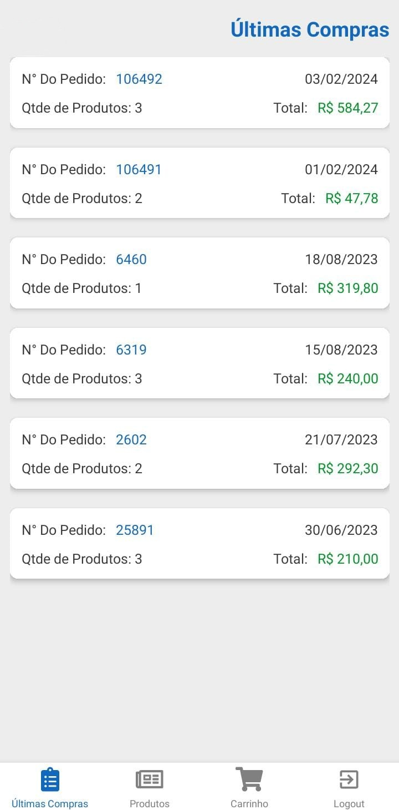
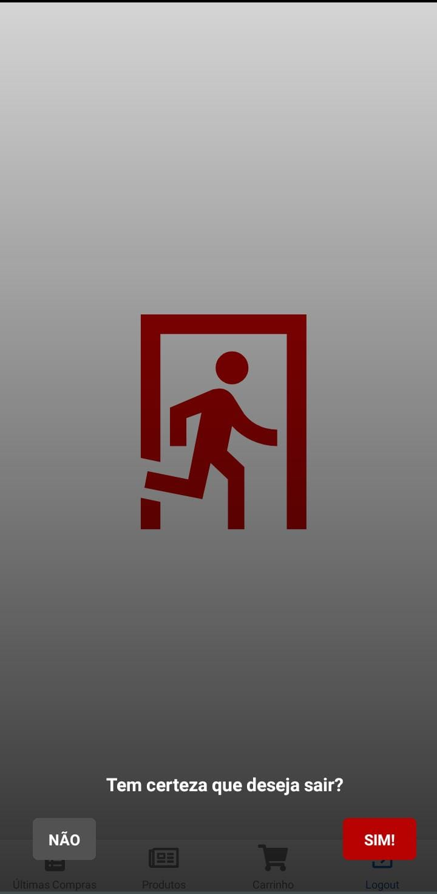
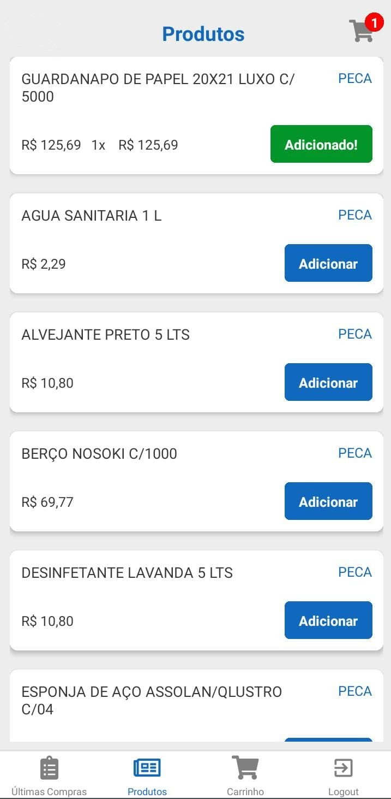
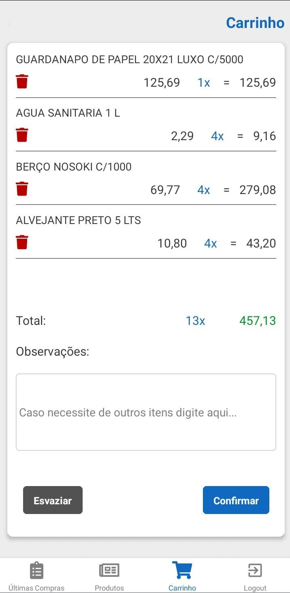

# Pequeno E-commerce React Native

<div align="center">
  
  
  
  
  
</div>

# Como Rodar o Projeto
Siga estas instruções para rodar o projeto em sua máquina local.

Pré-requisitos
Certifique-se de ter o seguinte instalado em sua máquina:

Node.js
React Native CLI
# Passos

Clone este repositório em sua máquina local usando o seguinte comando:

``` git clone https://github.com/seu-usuario/nome-do-repositorio.git

Substitua seu-usuario pelo seu nome de usuário do GitHub e nome-do-repositorio pelo nome do seu repositório.
Instale as Dependências e navegue até o diretório do projeto e instale as dependências usando npm ou yarn:

```bash
  npm install
```
ou 
```bash
 yarn install
```


Configuração para Android: Certifique-se de ter um emulador Android configurado ou um dispositivo Android conectado via USB com o modo de depuração ativado.
Execute o seguinte comando para iniciar o projeto no emulador Android:

```bash
 npx react-native run-android
```

Configuração para iOS: Certifique-se de ter um simulador iOS configurado no seu sistema.
Execute o seguinte comando para iniciar o projeto:

```bash
 npx react-native run-ios
```

Contribuindo
Se você quiser contribuir para este projeto, sinta-se à vontade para abrir um pull request. Ficarei feliz em analisá-lo e fundi-lo ao projeto.

Problemas
Se você encontrar algum problema ou tiver alguma dúvida, por favor, abra uma issue. Vou tentar ajudar da melhor maneira possível.